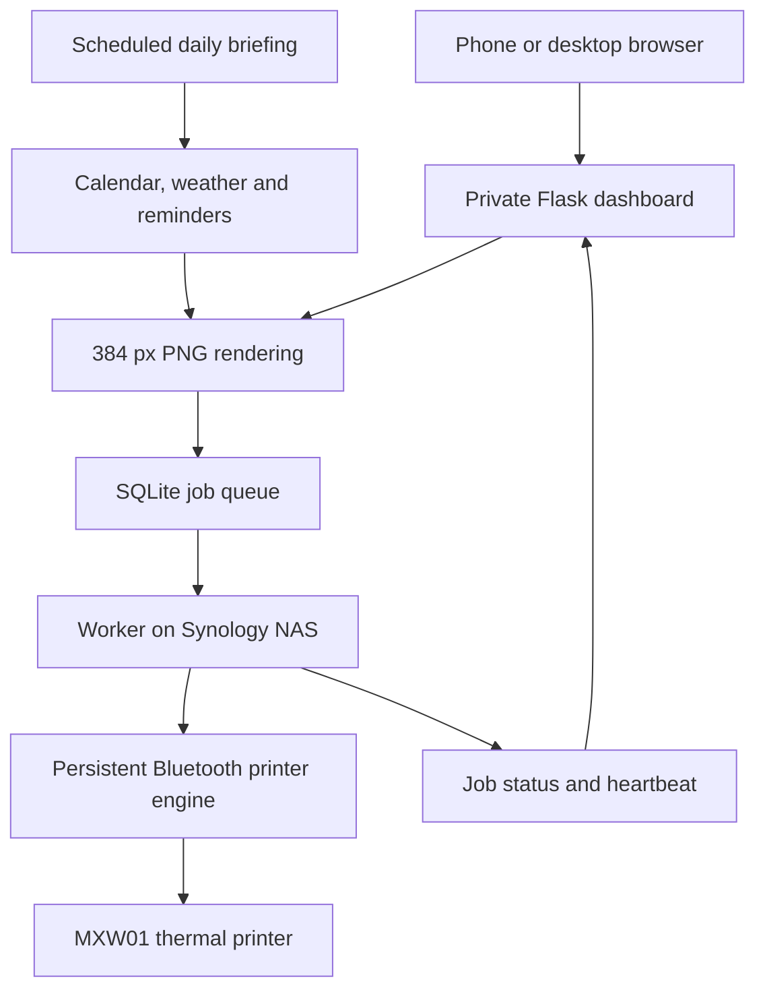

# MXW01 — A Small Printer, a Long Journey

A personal project that turns a small Bluetooth thermal printer I bought at **ALE-HOP**, identified in this project as **MXW01**, into a useful part of everyday life: a morning briefing, shopping lists, reminders, short notes and photographs, all controlled from an iPhone.

The idea was simple: put some of the information scattered across my phone onto a small piece of paper. Getting there involved a web server, an older Synology NAS, a persistent Bluetooth connection and quite a few rounds of “let's try this again”.

This README documents the working setup and some of the decisions behind it. The code excerpts are simplified examples, rather than a complete application to download and install.

## What it does

The private web dashboard supports:

- **A daily briefing:** calendar events for today and tomorrow, weather, reminders and a child's weekly school schedule.
- **Shopping lists and task lists:** one item per line, printed with checkboxes.
- **Free text:** notes, poems or whatever needs to go on paper, with bold, italic and heading formatting. No compulsory title.
- **Photographs:** monochrome conversion, brightness and contrast adjustments, rotation and a preview of the image that will be printed.

The interface is designed primarily for the iPhone, with system fonts, rounded cards, dark mode and an icon for the Home Screen. It also works in a desktop browser.

The daily briefing is configured for **07:00 on weekdays, using Europe/Lisbon time**.

## How it works



The server gathers information, renders images and manages the queue. The NAS polls for work, downloads each image and sends it to the printer over Bluetooth. It also reports its connection state and the outcome of each job.

Keeping those responsibilities separate made it possible to add new features without repeatedly changing the printing code that was already working.

## The setup

| Component | Role |
| --- | --- |
| Thermal printer bought at ALE-HOP (MXW01) | Bluetooth printing, 384 dots across |
| Synology DS119j running DSM 6.2.4 | Resident worker and persistent Bluetooth connection |
| TP-Link UB400 Nano USB Bluetooth 4.0 adapter | USB Bluetooth interface connected to the NAS |
| Python 3.8 on the NAS | Supervisor and printing process |
| Python 3.11 on cPanel hosting | Flask application, integrations and image rendering |
| SQLite | Job queue, authentication sessions and scheduling records |
| Pillow | Text rendering and photo conversion |
| CalDAV and pyicloud | Calendar events and reminders |
| Open-Meteo | Weather data |
| pillow-heif | HEIC image support |

The printer described here is the unit I bought at ALE-HOP; this does not imply that every thermal printer sold there uses the same hardware or protocol. This is an independent personal project, with no affiliation with ALE-HOP.

The Bluetooth adapter used in this working setup is a **TP-Link UB400 Nano USB Bluetooth 4.0 adapter**, connected to the Synology NAS. This documents the hardware I actually tested; the chipset and USB identifier have not been recorded here.

No replacement of the NAS's system Python, BlueZ or OpenSSL was needed.

## The parts that took some work

### Keeping Bluetooth connected

A successful test print was only the beginning. The printer engine needed to maintain a connection while idle, wait for queued work and reconnect after errors.

The engine connects before waiting for jobs, so an empty queue does not tear down the Bluetooth connection. After a printing error, it closes the suspect connection and lets the next iteration reconnect.

```python
# Adapted from the printer engine. Connection and job details are omitted.
while not self._stop_event.is_set():
    if not self.connected:
        try:
            self._connect()
        except Exception:
            time.sleep(self.reconnect_delay)
            continue

    try:
        job = self.queue.get(timeout=1)
    except queue.Empty:
        continue  # Keep the existing connection while idle.

    try:
        job.result = self.printer.print_rows(job.rows, intensity=job.intensity)
    except Exception as exc:
        job.error = exc
        self._disconnect()
    finally:
        job.done.set()
        self.queue.task_done()
```

The BLE backend uses `gatttool`. Once the printer engine and its GATT communication were working on the NAS, I kept that layer stable and built the dashboard and server features around it.

### Starting reliably on an older NAS

The resident worker uses a supervisor with rotating logs and automatic restart after an unexpected exit. A file lock prevents a second supervisor from starting another worker against the same printer.

```python
# Excerpt: keep the handle open for the supervisor's entire lifetime.
with lock_path.open("a+") as handle:
    try:
        fcntl.flock(handle, fcntl.LOCK_EX | fcntl.LOCK_NB)
    except BlockingIOError:
        return  # Another supervisor already holds the lock.

    supervise_worker()  # Placeholder for the supervised worker loop.
```

Starting from an SSH session worked before automatic startup did. During a real reboot, the scheduled task could run before the Python package was ready: the expected interpreter path temporarily failed with “No such file or directory”.

The solution was a boot-triggered task with bounded retries, rather than changing system software. This shortened example uses a fictional project path:

```sh
PROJECT=/volume1/projects/thermal-printer
PYTHON=/usr/local/bin/python3
attempt=1

while [ "$attempt" -le 60 ]; do
    if [ -x "$PYTHON" ] && [ -r "$PROJECT/mxw01_service.py" ]; then
        if "$PYTHON" "$PROJECT/mxw01_service.py" start; then
            exit 0
        fi
    fi
    attempt=$((attempt + 1))
    sleep 5
done
exit 1
```

A stop request also needed to mean “finish the current job, then close the connection”. Signal handlers set an event; the worker observes that event between jobs and uses it to interrupt idle waits.

```python
# Simplified excerpt from the worker's shutdown pattern.
stop_requested = threading.Event()


def request_stop(signum, frame):
    stop_requested.set()


signal.signal(signal.SIGTERM, request_stop)
signal.signal(signal.SIGINT, request_stop)

try:
    engine.start()
    while not stop_requested.is_set():
        poll_and_process_one_job(engine)  # Existing job-processing function.
        stop_requested.wait(5)
finally:
    engine.stop()
```

This handles normal service stops; it cannot prevent the operating system from terminating a process during a forced shutdown.

### Making the queue predictable

Jobs move through `queued`, `processing`, `completed` and `failed`. Claiming a job uses a SQLite transaction, so two workers cannot both claim the same queued job.

The essential idea looks like this:

```python
# Simplified excerpt: the real code also tracks timestamps and attempts.
with connection:
    connection.execute("BEGIN IMMEDIATE")
    job = connection.execute(
        "SELECT id FROM jobs WHERE status = 'queued' "
        "ORDER BY created_at LIMIT 1"
    ).fetchone()

    if job:
        connection.execute(
            "UPDATE jobs SET status = 'processing' WHERE id = ?",
            (job["id"],),
        )
```

A worker failure can leave a job marked `processing`. The server requeues jobs whose processing timestamp is more than ten minutes old, so they do not block the queue indefinitely. That recovery timeout is a practical choice for these short prints, rather than a lease renewed during printing.

### Scheduling in Lisbon time without duplicate daily jobs

The daily scheduler separately records which local date has already been queued. Running it every five minutes within the **07:00–07:30 window** permits another attempt if preparation fails, while avoiding duplicate automatic jobs for that date.

The application checks Lisbon time itself, including daylight saving changes, instead of assuming the hosting server uses the same timezone.

```python
# Adapted from the scheduler; the actual time is read from configuration.
from datetime import datetime, timedelta
from zoneinfo import ZoneInfo

now = datetime.now(ZoneInfo("Europe/Lisbon"))
start = now.replace(hour=7, minute=0, second=0, microsecond=0)
end = start + timedelta(minutes=30)
should_run = now.weekday() < 5 and start <= now < end
```

The job and its date record are committed in the same transaction. A crash cannot commit the job while losing the record that prevents the next scheduler invocation from creating another one.

```python
# Simplified excerpt: daily_runs.local_date has a PRIMARY KEY constraint.
with connection:
    connection.execute("BEGIN IMMEDIATE")
    exists = connection.execute(
        "SELECT job_id FROM daily_runs WHERE local_date = ?", (date_key,)
    ).fetchone()
    if exists:
        return  # Inside the scheduling function.

    insert_daily_job(connection, job_id, payload)  # Uses this same transaction.
    connection.execute(
        "INSERT INTO daily_runs (local_date, job_id, created_at) VALUES (?, ?, ?)",
        (date_key, job_id, created_at),
    )
```

A printer cannot make a physical print and a remote database update happen in one transaction. If printing succeeds but its acknowledgement is lost, recovery can still produce a duplicate. Recording a job once is not a guarantee of exactly one physical print.

### Giving every feature the same output

Text, lists, the daily briefing and photographs all become PNG images **384 pixels wide**. The NAS then rotates the image for the validated print orientation and converts it into printer rows.

That shared output format is what made the later features manageable. The orientation fix lives at the printer boundary, so text renderers and photo previews remain upright.

```python
# Adapted from the NAS image-preparation path.
with Image.open(image_path) as image:
    if image.width != 384:
        raise ValueError("Expected a 384-pixel-wide image")
    image.load()
    image = image.rotate(180, expand=False)
    rows = image_to_rows(image)  # Existing MXW01 raster conversion.

engine.print_and_wait(rows=rows, name=job_name, timeout=180)
# Report completion only after the printing call returns successfully.
mark_completed(job_id)
```

The 180° rotation is the correction validated on this setup; it is not a recommendation for every thermal printer.

### Getting photographs onto thermal paper

The printer produces black dots rather than continuous shades of grey. Photographs therefore need resizing and monochrome conversion. Dithering represents intermediate tones with patterns of dots.

```python
# Simplified excerpt: upload validation and orientation handling are omitted.
from PIL import Image, ImageEnhance, ImageOps

gray = ImageOps.grayscale(resized_photo)
gray = ImageEnhance.Brightness(gray).enhance(brightness)
gray = ImageEnhance.Contrast(gray).enhance(contrast)

print_image = gray.convert("1", dither=Image.Dither.FLOYDSTEINBERG)
```

The preview and queued job use the same converted PNG. JPEG, PNG, WebP and HEIC are supported. One additional surprise was JPEG photographs identified as **MPO**, which required accepting the container and reading its primary image.

```python
# Excerpt: inspect the decoded format, not just the filename extension.
with Image.open(upload_stream) as source:
    if source.format not in {"JPEG", "MPO", "PNG", "WEBP", "HEIF"}:
        raise ValueError("Unsupported photograph format")
    source.seek(0)
    image = ImageOps.exif_transpose(source)  # Correct camera orientation.
```

The full conversion path also checks upload size and pixel count, composites transparency onto white, limits print height and discards source metadata. The simplified example above omits those steps.

## Private access

The dashboard uses email and password authentication, revocable sessions, secure cookies and CSRF protection. The NAS has separate bearer-token authentication, so browser login does not interrupt its polling or heartbeat.

Original uploaded photographs are not retained as application files. Converted previews are private, temporary and tied to the browser session; queued print images are stored separately for the worker.

This public description excludes deployment credentials, account sessions and personal calendar or reminder data. Screenshots and any future examples should use fictional content.

## What has been validated

- Printing from the web dashboard.
- Clean service stop and restart, plus automatic startup after a NAS reboot.
- Connection reporting through the heartbeat.
- Daily briefing generation, manual printing and unattended weekday printing at 07:00 (Europe/Lisbon).
- Formatted free text and photograph printing.

Thermal photographs have limited detail, especially in dark areas. Long documents also consume more paper. The school schedule is a weekly timetable; it does not automatically account for holidays.

## Built through iteration

I developed this project with assistance from ChatGPT and Codex, using them to explore approaches, prepare code and work through errors. I chose the requirements, deployed the changes and tested the results on the actual NAS and printer.

The most useful habit was to validate one step at a time: get a print working, protect that working path, then build around it.

The result is a small printer that now has several everyday jobs — and a project that took rather more persistence than its size might suggest.

## Credits

The project uses Flask, Pillow, SQLite, Requests, CalDAV, pyicloud, recurring-ical-events, pillow-heif and Open-Meteo, together with existing MXW01 printer tooling. The interface and printed documents also use system fonts and the Manrope typeface.

These excerpts are adapted for explanation: imports, surrounding classes and helper implementations are omitted where appropriate. Before publishing the underlying printer tooling or a complete application, its source projects and applicable licences need to be identified and credited individually.
